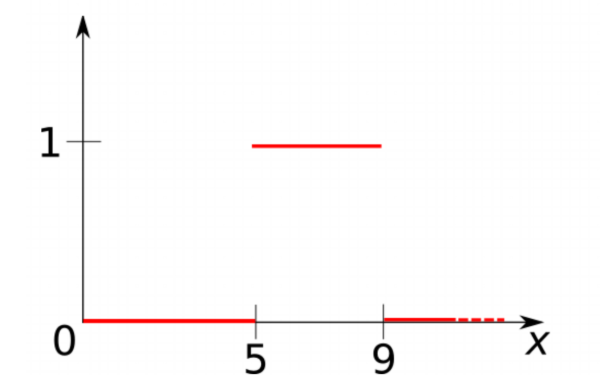
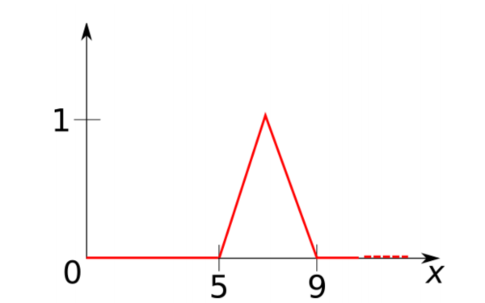
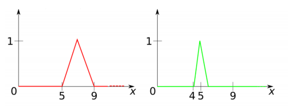
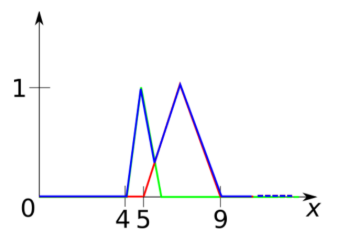
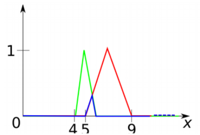
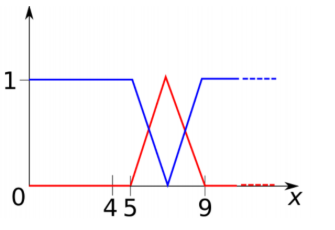

Title: Fuzzy First Order Logic 
description: A short tutorial on fuzzy first order logic (FFOL) 
hero: Short tutorial on Fuzzy First Order Logic
authors:
    - Abhishek Aggarwal
date: 2019-03-14

>   Logic (from the Greek "logos", which has a variety of meanings including word, thought, idea, argument, account,
    reason or principle) is the study of reasoning, or the study of the principles and criteria of valid inference and
    demonstration. It attempts to distinguish good reasoning from bad reasoning.

Conventional Logic typically deals with binary truth values {True/False}. However, real world (and human feelings for
certain) seldom works in binary. As humans, we constantly make choices on vague or imprecise judgements. For example, one
may not know for sure if it is going to rain (unless of course you are living in London, when not a day goes by without
raining) and yet she may decide to carry an umbrella, there by making binary decision based on non-binary reasoning.

For computers to be able to reason in real world and to solve real world problems, they must be equipped to 
make sense of such fuzzy data which is neither completely true, nor completely false. That is where Fuzzy Logic comes 
to the rescue. 

It is a branch of _many-valued symbolic logic_ which has comparative notion of truth, syntax, semantics, axiomatization, truth-preserving,
completeness, etc. Broadly speaking, Fuzzy logic serves mainly as apparatus for fuzzy control, analysis of vagueness in
natural language and several other application domains. It is one of the techniques of soft-computing, i.e. computational methods tolerant to
suboptimality and impreciseness (vagueness) and giving quick, simple and sufficiently good solutions.

In this blog post, I will summarise Fuzzy logic and more importantly Fuzzy First Order Logic (FFOL). This post is not
intended to be a rigorous mathematical treatment of the subject but rather a cheat-sheet that can be consulted to 
revise and reference important concepts.

## Crisp and Fuzzy Sets
In classical mathematics, one deals with collection of objects called _sets_. It is usually convenient to fix some 
universe $U$ in which every set is assumed to be included[^1].
Then a set $A$ can be thought of as a function on $U$ which takes a values of $1$ for objects that belong to $A$, $0$ otherwise.
Such a function is called the _characteristic function of $A$,  $\chi_A(.)$_: 

$$
\chi_A(x) := \begin{cases} 
                1 & x\in A \\
                0 & x \notin A 
            \end{cases}
$$

Obviously, this implies that there exist a _bijective mapping_ between characteristic function and maps. In fact, this is how
sets are defined in ZFC Set Theory.

???+ example "Crisp Set"
    Let $X$ be the set of all real numbers between 0 and 10 and let $A = [5, 9]$
    be the subset of $X$ of real numbers between 5 and 9. This results in the
    following figure:
    
    
    
    
Fuzzy sets generalise this definition, allowing elements to belong to a
given set with a certain degree. Instead of considering characteristic functions with value in ${0, 1}$, we
consider now functions valued in the interval $[0, 1]$. A fuzzy subset $F$ of a set $U$ is a function $\mu_F(·)$
assigning to every element $x \in U$ the degree of membership of $x$ to $F$:

$$
\mu_F : U \rightarrow [0, 1]
$$

???+ example "Fuzzy Set"
    Let, as above, U be the set of real numbers between 1 and 10. A description of the fuzzy set of real numbers
    _close to 7_ could be given by the following figure:
    
    
### Operations between crisp sets
In classical set theory there are some basic operations defined over
sets. Let $U$ be a set and $2^U$ (also known as power set) be the set of all subsets of U. Since there exists, a 
bijection between sets and the corresponding characteristic function, one could equivalently say that a power set, $2^U$
is a set defined by a characteristic function $\chi_{2^U}: U \rightarrow \{0, 1\}$.

The operation of union, intersection and complement are defined in the following ways:

| Operation     | Crisp Set | Characteristic Function  |
| :---------    | :------: | :------: |
| **Union**         | $A \cup B = \{x \mid x \in A \ or\  x \in B\}$ | $\chi_{A \cup B}(x) = max(\chi_A(x), \chi_B(x))$ |
| **Intersection**  | $A \cap B = \{x \mid x \in A \ and\  x \in B\}$| $\chi_{A \cap B}(x) = min(\chi_A(x), \chi_B(x))$ |
| **Compliment**    | $\bar{A} = \{ x \in U \mid x \notin A \}$ | $\chi_{\bar{A}}(x) = 1 - \chi_A(x)$ |

### Operations between fuzzy sets
While concept of binary membership ($\in$) does not exist in fuzzy sets, we can draw parallels to the characteristic 
function for crisp set and apply that to membership functions of fuzzy set analogously to derive set operations.

| Operation     | Fuzzy Set Membership Function | 
| :---------    | :------: | 
| **Union**         | $\mu_{A \cup B}(x) = max(\mu_A(x), \mu_B(x))$ |
| **Intersection**  | $\mu_{A \cap B}(x) = min(\mu_A(x), \mu_B(x))$ |
| **Compliment**    |  $\mu_{\bar{A}}(x) = 1 - \mu_A(x)$ |

???+ example "Fuzzy Set Operations"
    Let $A$ and $Bs$ be fuzzy subsets of $U$ given by membership functions $\mu_F$ and $\mu_S$: 
    
    
    | Union | Intersection | Compliment | 
    | :---:| :----: | :---: |
    |$\mu_{A \cup B}(x) = max(\mu_A(x), \mu_B(x))$|  $\mu_{A \cap B}(x) = min(\mu_A(x), \mu_B(x))$ | $\mu_{\bar{A}}(x) = 1 - \mu_A(x)$  |
    | |  | 

[^1]: Refer to ZFC Set theory and famous Russel's paradox for more rigorous arguments.

## References
1. [Neural-Symbolic Learning and Reasoning with Constraints
Tutorial at IEEE IJCNN 2018](https://drive.google.com/file/d/1OkCKtQV56OnjrRmAxwuA_59U-ZUr19S1/view)