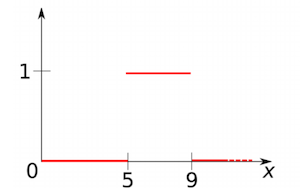

Title: Fuzzy Propositional Logic
description: A short tutorial on fuzzy propositional
hero: Short tutorial on Fuzzy Propositional Logic
authors:
    - Abhishek Aggarwal
date: 2019-03-14

>   Logic (from the Greek "logos", which has a variety of meanings including word, thought, idea, argument, account,
    reason or principle) is the study of reasoning, or the study of the principles and criteria of valid inference and
    demonstration. It attempts to distinguish good reasoning from bad reasoning.

Conventional Logic typically deals with binary truth values {True/False}. However, real world (and human feelings for
certain) seldom works in binary. As humans, we constantly make choices on vague or imprecise judgements. For example, one
may not know for sure if it is going to rain (unless of course you are living in London, when not a day goes by without
raining) and yet she may decide to carry an umbrella, there by making binary decision based on non-binary reasoning.

For computers to be able to reason in real world and to solve real world problems, they must be equipped to 
make sense of such fuzzy data which is neither completely true, nor completely false. That is where Fuzzy Logic comes 
to the rescue. 

It is a branch of _many-valued symbolic logic_ which has comparative notion of truth, syntax, semantics, axiomatization, truth-preserving,
completeness, etc. Broadly speaking, Fuzzy logic serves mainly as apparatus for fuzzy control, analysis of vagueness in
natural language and several other application domains. It is one of the techniques of soft-computing, i.e. computational methods tolerant to
suboptimality and impreciseness (vagueness) and giving quick, simple and sufficiently good solutions.

In this blog post, I will summarise Fuzzy propositional logic. This post is not intended to be a rigorous mathematical
 treatment of the subject but rather a cheat-sheet that can be consulted to revise and reference important concepts.

## Crisp and Fuzzy Sets
In classical mathematics, one deals with collection of objects called _sets_. It is usually convenient to fix some 
universe $U$ in which every set is assumed to be included[^1].
Then a set $A$ can be thought of as a function on $U$ which takes a values of $1$ for objects that belong to $A$, $0$ otherwise.
Such a function is called the _characteristic function of $A$,  $\chi_A(.)$_: 

$$
\chi_A(x) := \begin{cases} 
                1 & x\in A \\
                0 & x \notin A 
            \end{cases}
$$

Obviously, this implies that there exist a _bijective mapping_ between characteristic function and maps. In fact, this is how
sets are defined in ZFC Set Theory.

???+ example "Crisp Set"
    Let $X$ be the set of all real numbers between 0 and 10 and let $A = [5, 9]$
    be the subset of $X$ of real numbers between 5 and 9. This results in the
    following figure:
    
    
    
    
Fuzzy sets generalise this definition, allowing elements to belong to a
given set with a certain degree. Instead of considering characteristic functions with value in ${0, 1}$, we
consider now functions valued in the interval $[0, 1]$. A fuzzy subset $F$ of a set $U$ is a function $\mu_F(·)$
assigning to every element $x \in U$ the degree of membership of $x$ to $F$:

$$
\mu_F : U \rightarrow [0, 1]
$$

???+ example "Fuzzy Set"
    Let, as above, U be the set of real numbers between 1 and 10. A description of the fuzzy set of real numbers
     _close to 7_  could be given by the following figure:
    
    
    
### Operations between crisp sets
In classical set theory there are some basic operations defined over
sets. Let $U$ be a set and $2^U$ (also known as power set) be the set of all subsets of U. Since there exists, a 
bijection between sets and the corresponding characteristic function, one could equivalently say that a power set, $2^U$
is a set defined by a characteristic function $\chi_{2^U}: U \rightarrow \{0, 1\}$.

The operation of union, intersection and complement are defined in the following ways:

| Operation     | Crisp Set | Characteristic Function  |
| :---------    | :------: | :------: |
| **Union**         | $A \cup B = \{x \mid x \in A \ or\  x \in B\}$ | $\chi_{A \cup B}(x) = max(\chi_A(x), \chi_B(x))$ |
| **Intersection**  | $A \cap B = \{x \mid x \in A \ and\  x \in B\}$| $\chi_{A \cap B}(x) = min(\chi_A(x), \chi_B(x))$ |
| **Compliment**    | $\bar{A} = \{ x \in U \mid x \notin A \}$ | $\chi_{\bar{A}}(x) = 1 - \chi_A(x)$ |

### Operations between fuzzy sets
While concept of binary membership ($\in$) does not exist in fuzzy sets, we can draw parallels to the characteristic 
function for crisp set and apply that to membership functions of fuzzy set analogously to derive set operations.

| Operation     | Fuzzy Set Membership Function | 
| :---------    | :------: | 
| **Union**         | $\mu_{A \cup B}(x) = max(\mu_A(x), \mu_B(x))$ |
| **Intersection**  | $\mu_{A \cap B}(x) = min(\mu_A(x), \mu_B(x))$ |
| **Compliment**    |  $\mu_{\bar{A}}(x) = 1 - \mu_A(x)$ |

???+ example "Fuzzy Set Operations"
    Let $A$ and $Bs$ be fuzzy subsets of $U$ given by membership functions $\mu_A$ and $\mu_B$: 
    
    
    | Union | Intersection | Compliment | 
    | :---:| :----: | :---: |
    |$\mu_{A \cup B}(x) = max(\mu_A(x), \mu_B(x))$|  $\mu_{A \cap B}(x) = min(\mu_A(x), \mu_B(x))$ | $\mu_{\bar{A}}(x) = 1 - \mu_A(x)$  |
    | |  | 
    
## Fuzzy propositional logic
In classical propositional logic, a propositional language consists of _only_ propositions, i.e., statements that can be 
assigned either True or False. Statements of the form "It is raining.", "Today is Sunday.", "2+2=5" are all examples of 
valid propositions. "Open the door", "Ecstatic feeling", "Run!", "How many planets are there in solar system?" cannot be 
assigned simple binary truth values and are thus not propositions.  
 
 
It is convenient to define unary and binary operations on propositions. A unary operator takes one proposition to create
a new proposition. Since there are two truth values, there are exactly four ($2^2$) unary operators, there are
Identity, Compliment, Tautology and Contradiction.

| $X$  | Identity $(X)$ | Compliment $\bar{X}$ | Tautology $\top(X)$ | Contradiction $\bot(X)$ | 
| :-:| :------: | :------: | :------: | :------: | 
| T  | T | F | T | F |
| F  | F | T | T | F |

A binary operator (often called a connective) takes two proposition to create a new proposition. Consequently, it is possible
to define 16 ($2^4$) binary connectives. Most prominent of those are Conjunction, Disjunction, Implication, Equivalence,
and Xor. It is easy to show that all 16 connective equivalent can be obtained by unique application of these 
binary connectives [^2].

| X | Y | $X \wedge Y$ | $X \lor Y$| $X \Rightarrow Y$ | $X \Leftrightarrow Y$ | $X \oplus Y$ |  
|:--:|:--:|:--:|:--:|:--:|:--:|:--:|
| T | T | T | T | T | T | F |
| T | F | F | T | F | F | T |
| F | T | F | T | T | F | T |
| F | F | F | F | T | T | F |

We can generalize the classical propositional logic to incorporate fuzziness, such that proposition values are in $[0, 1]$
and that _if $x > y$, then $x$ is more true than $y$_.  

### Fuzzy Conjunction: Triangular-norm (T-norm)
The conjunction connective in fuzzy logic is formalized by a binary operation on truth values, called _t-norm_, which
satisfy a minimal set of properties to capture the intuitive meaning of conjunction.

!!! Definition "Definition T-norm"
    A _t-norm_ is a binary operation $\otimes:[0, 1]^2 \rightarrow [0, 1]$ satisfying the following conditions:
    
    1. **Commutativity:** $x \otimes y = y \otimes x$
    2. **Associativity:** $x \otimes (y \otimes z) = (y \otimes x) \otimes z$
    3. **Non-decreasing:** $x \leq y \Rightarrow z \otimes x \leq z \otimes y$
    4. **Zero and One:** $0 \otimes x = 0$ and $1 \otimes x = x$
    
    A t-norm $\otimes$ is continuous if the function $\otimes:[0, 1]^2 \rightarrow [0, 1]$ is a continuous function in the usual sense.
    
    ##### Examples
    |Name| Definition| Visualization|
    |:--:|:--|:--:|
    |**Lukasiewicz t-norm**| $x \otimes y = max(0, x + y − 1)$||
    |**G̈odel t-norm**| $x \otimes y = min(x, y)$||
    |**Product t-norm**| $x \otimes y = x \cdot y$||
    
### Fuzzy Disjunction: T-Conorm (or S-norm)
The conjunction connective in fuzzy logic is formalized by a binary operation on truth values, called _t-conorm_, which
satisfy a minimal set of properties to capture the intuitive meaning of disjunction. The name t-conorm is comes from the
fact that disjunction is a dual operation to conjunction.

!!! Definition "Definition T-conorm (also called S-norm)"
    A _t-conorm_ is a binary operation $\oplus:[0, 1]^2 \rightarrow [0, 1]$ satisfying the following conditions:
    
    1. **Commutativity:** $x \oplus y = y \oplus x$
    2. **Associativity:** $x \oplus (y \oplus z) = (y \oplus x) \oplus z$
    3. **Non-decreasing:** $x \leq y \Rightarrow z \oplus x \leq z \oplus y$
    4. **Zero and One:** $0 \oplus x = x$ and $1 \oplus x = 1$

    Given a t-norm $\otimes$, a corresponding t-conorm can be derived as 
    
    $$
    x \oplus y = 1 - ( 1 - x ) \otimes ( 1 - y)
    $$
        
    
    ##### Examples
    |Name| Definition| Visualization|
    |:--:|:--|:--:|
    |**Lukasiewicz t-conorm**| $x \oplus y = min(1, x + y)$||
    |**G̈odel t-conorm**| $x \oplus y = max(x, y)$||
    |**Product t-conotm**| $x \oplus y = x + y - x \cdot y$||

### Fuzzy Implication: Residuum
Intuitively the more $x \Rightarrow y$ is true, the less additional information is carried by $y$ w.r.t., $x$. Thus, for 
t-norm $\otimes$, following property should hold for residuum $\Rightarrow$ :

$$
     z \otimes x \quad if \; and \; only \; if \quad z \leq ( x \Rightarrow y) 
$$ 

Semantics of residuum are therefore defines as the maximum truth value to be "added" to $x$ to obtain $y$.

!!! Definition "Definition Residuum"
    The residuum of the _t-norm_ $\otimes$ is a binary operation $\otimes:[0, 1]^2 \rightarrow [0, 1]$ is defined as
    
    $$
    (x \Rightarrow y) = max(\{ z \mid x \otimes z <= y\})
    $$ 
    
    Properties of Residua:    
    
    1. If $x \leq y$ then $(x \Rightarrow y) = 1$
    2. $(1 \Rightarrow x) = x$
    3. $(x \Rightarrow 1) = 1$
    4. If $x \leq y$ then $x = y \otimes (y \Rightarrow x)$
        
    ##### Examples
    If $x \leq y$, then $(x \Rightarrow y) = 1$, however, when $x > y$, then
     
    |Name| Definition| Visualization|
    |:--:|:--|:--:|
    |**Lukasiewicz Residuum**| $(x \Rightarrow y) =  1 - x + y$||
    |**G̈odel Residuum**| $(x \Rightarrow y) = y$||
    |**Product Residuum**| $(x \Rightarrow y) = y/x$||
    
### Fuzzy Negation: Precompliment
In classical propositional logic, negation can be thought as implication of contradiction, i.e.,
 $\bar{X} \Leftrightarrow (X \Rightarrow \bot)$ can shown in table below
 
| $X$ | $\bot$ | $(X \Rightarrow \bot)$ | $\bar{X}$ 
|:--:|:--:|:--:|:--:|
|T|F|F|F|
|F|F|T|T|

Negation can be defined analogously for fuzzy propositional logic.

!!! Definition "Definition Precompliment"
    For every residual operator $ \Rightarrow $ (and therefore for every t-norm), 
    the precomplement operator denoted by $(−)$, is defined as:
    
    $$
    (-)x = (x \Rightarrow 0)
    $$   
    
    ##### Examples
    |Name| Definition|
    |:--:|:--:|
    |**Lukasiewicz t-conorm**| $(-)x = 1 - x$|
    |**G̈odel t-conorm**| $(-)x = \begin{cases}  1 & x = 0 \\ 0 & otherwise \end{cases}$|
    |**Product t-conotm**|$(-)x = \begin{cases}  1 & x = 0 \\ 0 & otherwise \end{cases}$|
 
 
This concluded the post on fuzzy propositional logic. The next step to study fuzzy first order logic or fuzzy predicate logic
involving quantors, namely _for all_ ($\forall$) and _there exists_ ($\exists$). 

[^1]: Refer to ZFC Set theory and famous Russel's paradox for more rigorous arguments.
[^2]: Infact, it can be shown that only NAND or only NOR operation is complete and all other propositional transformation circuits can be created from NAND or NOR alone.

## References
1. [Neural-Symbolic Learning and Reasoning with Constraints
Tutorial at IEEE IJCNN 2018](https://drive.google.com/file/d/1OkCKtQV56OnjrRmAxwuA_59U-ZUr19S1/view)
2. [T-norm, Wikipedia](https://en.wikipedia.org/wiki/T-norm)