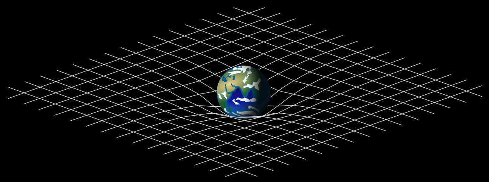

Title: Chapter 1
description: Tensor motivation and defintion
hero: Series on Tensor Algebra
authors:
    - Abhishek Aggarwal
date: 2018-10-14

# **Chapter 1**

Welcome to this blog series on Tensor Algebra. This blog series is my attempt to explain Tensor Algebra as I learnt from various sources over the Internet. This chapter is mostly to motivate why you might want to study Tensor Algebra.

## Pre-requisite
This blog series assumes a familiarity with Linear Algebra (concepts like matrix-multiplication, dot products, linear combination, etc.) This blog should be particularly helpful for those who never had formal college degree in Physics and as such find it hard to delve into certain subjects where Tensors are pre-requisite. No knowledge of calculus is needed to study Tensor Algebra. I may do a follow up series on Tensor Calculus though.

## Why would you want to study Tensor Algebra?
Most people first hear about Tensor Algebra when they start out their journey to delve deeper into the _General Theory of Relatively (GTR)_. In GTR, Eistein shows how space-time forms a single object which is curved by massive objects ( and other crazy ideas like blackholes and gravitational waves).

You might have also heard of big bang and how universe is expanding since. Tensors are an indispensable tool to understand what these mean mathematically.

Another popular example where tensors come up often is _Quantum Mechanics(QM)_ and _Quantum Computing(QC)_, In QM, the mystical concept of Quantum Superposition where in a particles can remain in multiple states until it is observed is essential _linear combination_ of tensors which we will be cover later.

 

You may have heard that nothing travels faster than speed of light, yet if you separate two particles whose states are entangled, simple act of observing one instantaneously affects the other. Again, this is mathematically represented by _tensor product_ which we will cover as well later in this series.

There is probably nothing more intriguing and fascinating than the unintuitive world of small scale (QM) as well as mind warping idea that time isn't same for everyone or that our universe is expanding. Tensors is a beautiful theory that allows one to study the underlying (complicated) Geometry of Space-time, something that one cannot get just by watching popular science articles or documentaries on these topics.

!!! quote "Alfred North Whitehead said"
    The idea that physicists would in future have to study the theory of tensors created real panic amongst them following the first announcement that Eistein's predictions had been verified.  

However, GTR and QM are not the only subjects tensors are used in. Tensors are prevalent in many domains of engineering and science, and good understanding of tensors would build a solid foundation for learning numerous other STEM subjects.

## What are Tensors?
It is hard to explain what Tensor is. Different people tend to give different definition of tensor. And whats worse is that most of them are partially correct, but none completely. There are generally three ways to think about Tensor.

1. **Tensors are ^^multi-dimensional arrays.^^** 
An array is a list of numbers. If you replicate that list multiple times, like a table or MS excel, than it is called a 2-D array and so on and so forth. For example, you may have heard of popular scientific computation library called _TensorFlow_, which is all about manipulation of multi-dimensional arrays. Tensors are characterised by rank, as follows:

    * Scalar (rank 0 tensor): $[5], [1], [2.5], [\pi]$
    * Vector (rank 1 tensor): $[1, 2, 3]$, $[0.1, 3, \sqrt{2}]$
    * Matrix (rank 2 tensor): $\begin{bmatrix}a & b\\c & d\end{bmatrix}$, $\begin{bmatrix}1 & 2 & 3\\4 & 5 & 6\end{bmatrix}$
    * So on for rank 3, 4, ...
        
    !!! failure "This definition is incorrect"
        Because while, ^^Tensors can be represented as multi-dimensional arrays^^, tensors as concept are much more than just bunch of numbers. While calling multidimensional arrays tensor is generally accepted in Machine Learning community, it is not strictly correct. Tensors have geometrical meaning which is not apparent in this definition.

2. **Tensor is an object that is ^^invariant^^ under a ^^change of coordinates^^**.
Under this definition, Tensors as object do not change when viewed from different coordinate system. As the choice of coordinate system changes (say Castersian to Polar), the representation of the same tensor in terms of the coordinate **does** change, however. The change is predictible allowing us to go back and forth from one coordinate system to another using known transformation rules.
